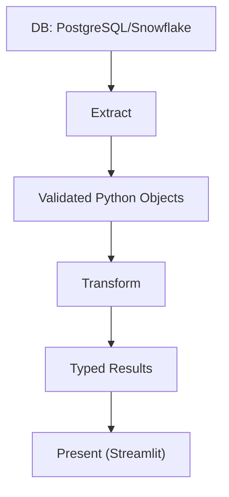
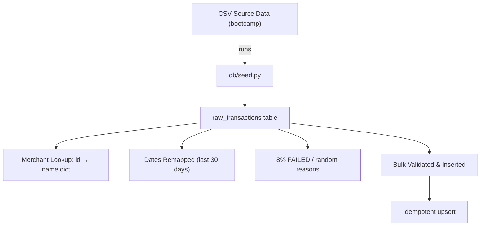
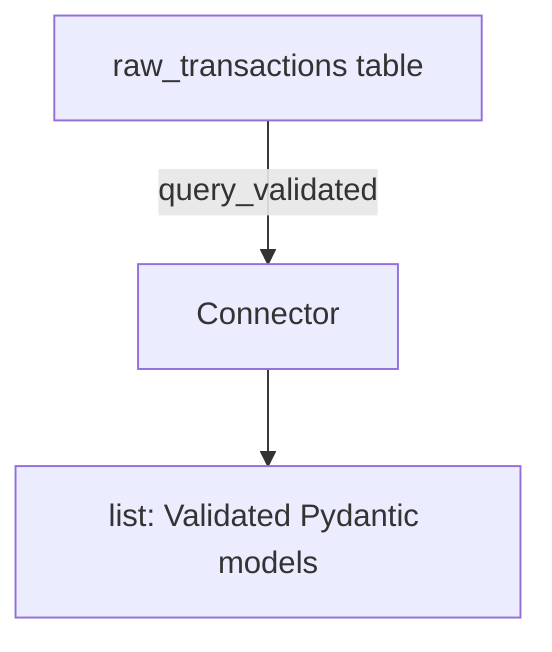
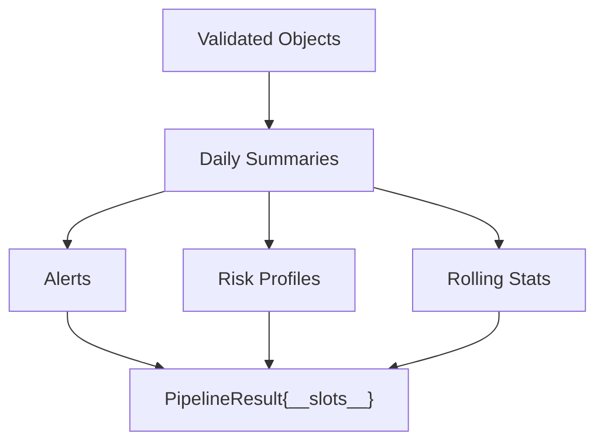
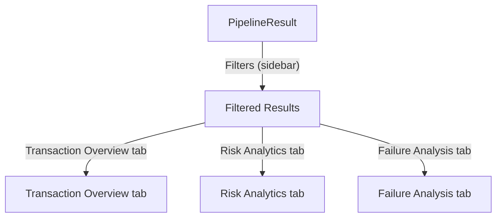
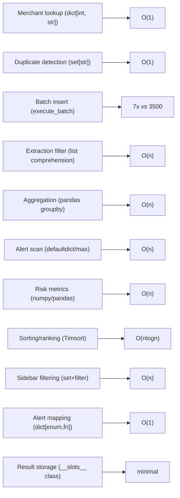

# CardStream Architecture (Short Form)

## Pipeline

CardStream runs a classic Extract–Transform–Present pipeline.

<!-- Mermaid Syntax Fix: Use correct arrow types and avoid ambiguous node labels -->

All data between stages is strictly typed (Pydantic models) to ensure data integrity and reliability throughout the flow.

---

## Data Seeding

The system seeds the database with realistic transactional test data and performs essential validations.

<!-- Mermaid Syntax Fix: Use subgraph and correct dotted/normal links -->

Key steps:
- Merchant lookup for fast ID→name mapping (`dict[int, str]`)
- Dates remapped to last 30 days (dashboard always fresh)
- 8% of transactions randomly FAILED with rotating reasons
- Batch validated (uniqueness, completeness, consistency)
- Bulk-inserted (500 rows per batch, idempotent via `ON CONFLICT DO NOTHING`)

_Schema checks:_
- PK: `transaction_id`
- Amount > 0, valid statuses, `failure_reason` for FAILED
- Indexes on merchant/date/status

---

## Extraction

Extraction uses a unified connector protocol for consistent, validated data access.

Connector types:
- **PgConnector:** SQLAlchemy + pandas (PostgreSQL)
- **SiSConnector:** Snowpark + pandas (Snowflake, cached)
- **MockConnector:** in-memory for tests

All extracted rows are Pydantic-validated; pipeline skips invalids and continues.

---

## Transformation

Data is transformed through a series of pure, composable functions.

<!-- Mermaid Syntax Fix: clearer nodes, uniq IDs -->

- **A. Daily Summaries:** Group by (merchant, day) via pandas. Yields totals, counts, failures, failure rates.
- **B. Alerts:** Scans for high failure rates, assigns OK/WARNING/CRITICAL severity.
- **C. Risk Profiles:** Computes Sharpe/Sortino/max drawdown/VaR/risk tier (history required).
- **D. Rolling Stats:** Computes 7-day rolling means/volatility/etc for trends.

All transformation code is pure (no I/O) and fully testable.

---

## Presentation

Streamlit app (`app.py`) powers the UI:

- Extract/transform/filter in a single pass
- Sidebar input filters: lookback, merchant, risk, reason
- Rendered into 3 interactive Streamlit tabs:
    - **Transaction Overview:** Trends, failure bars, merchant KPIs
    - **Risk Analytics:** Ratios and risk visualizations
    - **Failure Analysis:** Failure reasons/top offenders, filterable table with CSV export

_Rendering:_
- Plotly charts: `st.plotly_chart`
- Seaborn/matplotlib: PNG via `st.image`
- Alert banner: maps severity to `st.success`/`st.warning`/`st.error`

---

## Data & Algorithm Cheatsheet

The architecture leverages appropriate data structures and algorithms for efficient, scalable analytics.

<!-- Mermaid Syntax Fix: node/edge labels as node names, avoid colons and use unique node IDs -->

| Step                  | Structure            | Algorithm            | Cost     |
|-----------------------|---------------------|----------------------|----------|
| Merchant lookup       | dict[int, str]      | hash lookup          | O(1)     |
| Duplicate detection   | set[str]            | membership test      | O(1)     |
| Batch insert          | execute_batch       | batched SQL          | 7x vs 3500|
| Extraction filter     | list compr.         | validate/filter      | O(n)     |
| Aggregation           | pandas groupby      | hash aggregation     | O(n)     |
| Alert scan            | defaultdict/max     | 2 linear scans       | O(n)     |
| Risk metrics          | numpy, pandas       | sliding, diffs       | O(n)     |
| Sorting/ranking       | list.sort           | Timsort              | O(nlogn) |
| Sidebar filtering     | set+filter          | fast membership      | O(n)     |
| Alert mapping         | dict[enum, fn]      | O(1) dispatch        | O(1)     |
| Result storage        | __slots__ class     | fixed attrs          | minimal  |

---

**Summary:**  
CardStream cleanly separates data, transforms, and presentation. All flow between layers is strictly typed and validated. Transform code is pure and testable; all UI code is interactive and fast. Algorithms and data structures are chosen for linear or better performance on realistic data volumes. Visual diagrams above help clarify each stage and flow of information through the system.
