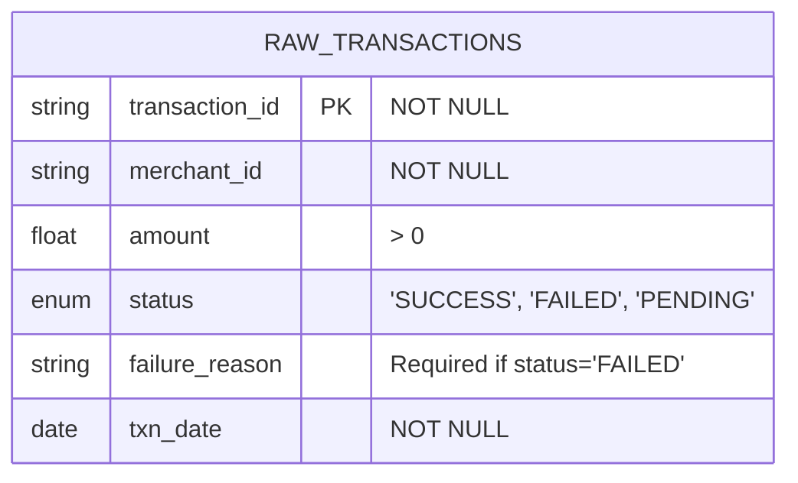
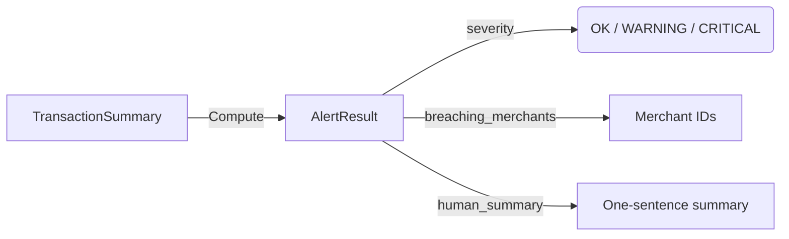
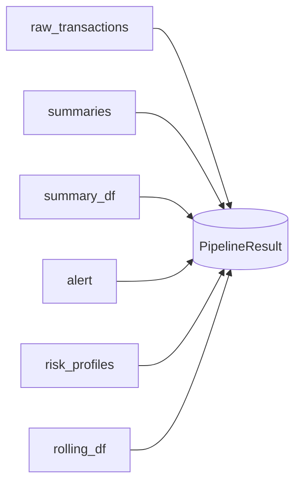

# Data Dictionary

Concise guide to all fields, constraints, and main sources.

---

## raw_transactions

**Source:** `db/schema.sql`, `src/schemas/payments.py`



| Field            | Type             | Constraints                    | Origin                         |
|------------------|------------------|-------------------------------|--------------------------------|
| transaction_id   | str              | PK, NOT NULL                  | `TXN-{id:05d}` from CSV        |
| merchant_id      | str              | NOT NULL                      | From `merchant.csv`            |
| amount           | float            | > 0 (Python+SQL)              | CSV, positive only             |
| status           | enum             | 'SUCCESS', 'FAILED', 'PENDING'| 92% S / 8% F (random in seed)  |
| failure_reason   | str \| None      | Required if status='FAILED'    | 5 random categories            |
| txn_date         | date             | NOT NULL                      | CSV, mapped to last 30 days    |

**Rules:**
- `FAILED` ⇒ `failure_reason` required (enforced in Python & SQL)
- Others ⇒ `failure_reason` can be NULL

**Indexes:** merchant+date, date, status (B-tree)

---

## TransactionSummary

Computed in `src/backend/transforms/daily_summary.py`

**Visualization:** One per (merchant, date) tuple—essentially a groupby result.

```mermaid
flowchart LR
    A[raw_transactions] -->|group by merchant_id, txn_date| B[TransactionSummary]
    B -.-> C[total_volume = SUM(amount)]
    B -.-> D[txn_count = COUNT(amount)]
    B -.-> E[failure_rate = failed/total]
```

| Field         | Type   | Range       | How                      |
|---------------|--------|-------------|--------------------------|
| merchant_id   | str    | any         | Group key                |
| txn_date      | date   | any         | Group key                |
| total_volume  | float  | ≥ 0         | SUM(amount)              |
| txn_count     | int    | ≥ 1         | COUNT(amount)            |
| failure_rate  | float  | 0-1         | Failed/Total (Pydantic)  |

---

## MerchantRiskProfile

From `risk_metrics.py`. One per merchant (≥3 days):

```mermaid
flowchart TD
    S[TransactionSummary (days)] -->|Roll up| M[MerchantRiskProfile]
    M -.-> SH[sharpe_ratio]
    M -.-> SO[sortino_ratio]
    M -.-> CA[calmar_ratio]
    M -.-> DD[max_drawdown]
    M -.-> VR[value_at_risk_95]
    M -.-> RR[risk_rating]
```

| Field              | Type      | Range         | How                               |
|--------------------|-----------|---------------|-----------------------------------|
| merchant_id        | str       | -             | Group key                         |
| days_observed      | int       | ≥ 3           | Length(success_rate array)        |
| avg_success_rate   | float     | 0-1           | Mean(1 - failure_rate)            |
| success_rate_std   | float     | ≥ 0           | Stddev(success_rate)              |
| sharpe_ratio       | float\|None | any / None   | (mean × 365)/(std × √365)         |
| sortino_ratio      | float\|None | any / None   | Downside std in denominator       |
| calmar_ratio       | float\|None | any / None   | ann. excess / max_drawdown        |
| max_drawdown       | float     | 0-1           | Peak-to-trough                    |
| value_at_risk_95   | float     | 0-1           | 5th percentile of success rates   |
| avg_daily_volume   | float     | ≥ 0           | Mean(total_volume/days)           |
| total_volume       | float     | ≥ 0           | Sum(total_volume)                 |
| risk_rating        | str       | LOW/MED/HIGH  | Decision tree on risk metrics     |

Risk rating logic (decision tree):
- **LOW:** Sharpe ≥1, drawdown <5%, VaR ≥ SLA
- **HIGH:** Sharpe <0, drawdown ≥15%, VaR <90% SLA
- **Else:** MEDIUM

---

## AlertConfig

From `alert_models.py`

| Field                 | Type    | Range       | Default |
|-----------------------|---------|-------------|---------|
| warning_threshold     | float   | (0,1]       | 0.20    |
| critical_threshold    | float   | (0,1]       | 0.40    |
| min_transaction_count | int     | ≥1          | 5       |

---

## AlertResult

From `alert_models.py`, computed.



| Field               | Type        | Values                  |
|---------------------|-------------|-------------------------|
| severity            | enum        | OK, WARNING, CRITICAL   |
| breaching_merchants | list[str]   | IDs triggering alert    |
| human_summary       | str         | One-sentence summary    |

---

## Rolling Statistics DataFrame

From `risk_metrics.py` (`compute_rolling_success`):

```mermaid
flowchart LR
    TS[TransactionSummary (by day, merchant)] -->|windowed calc| ROLLING[Rolling Statistics DataFrame]
    ROLLING -- computes --> M[rolling_mean]
    ROLLING -- computes --> STD[rolling_std]
    ROLLING -- computes --> DC[daily_change]
```

| Column         | Type     | Range       | Compute                |
|----------------|----------|-------------|------------------------|
| merchant_id    | str      | any         | Group                   |
| txn_date       | date     | any         | From summary           |
| success_rate   | float    | 0-1         | 1 - failure_rate        |
| daily_change   | float    | Any, NaN 1st| Diff(success_rate)      |
| rolling_mean   | float    | 0-1         | 7-day window mean       |
| rolling_std    | float    | ≥0, NaN<2   | 7-day stddev            |

---

## PipelineResult

From `pipeline.py`, orchestrator output:



- raw_transactions: list[RawTransaction]
- summaries: list[TransactionSummary]
- summary_df: pd.DataFrame
- alert: AlertResult
- risk_profiles: list[MerchantRiskProfile]
- rolling_df: pd.DataFrame
