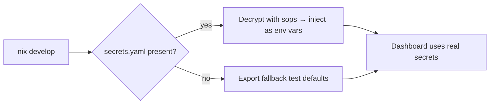

# Secrets Management (SOPS + age)

CardStream uses [SOPS](https://github.com/getsops/sops) and [age](https://github.com/FiloSottile/age) to securely handle secrets and configuration.

---

### Visual Overview

```mermaid
flowchart TD
    A[.sops.yaml <br> (public key, config)] -- committed --> D[SOPS-encrypted<br>secrets.yaml]
    B[secrets.yaml <br> (decrypted temp)] -- loaded by shellHook --> E[Nix Dev Shell]
    C[keys.txt (private key) <br> (~/.config/sops/age/keys.txt)] -- required to decrypt --> D
    D -- decrypt on demand --> B
    E -- uses env vars --> F[PostgreSQL/Services]

    style C fill:#ffeaea,stroke:#e34c26,stroke-width:2px
    style D fill:#ffe7d1,stroke:#e78c1a,stroke-width:1.5px
    style A fill:#dbeafe,stroke:#2563eb,stroke-width:1.5px
    style E fill:#e0ffe0,stroke:#15d01a,stroke-width:1px
```
*Red: never commit. Blue/Orange: safe to commit.*

---

### File Roles

| File                                     | Git?  | What/Where                | Type    |
|-------------------------------------------|-------|---------------------------|---------|
| **secrets.yaml**                          | Yes   | Main encrypted config     | Encrypted YAML |
| **.sops.yaml**                            | Yes   | SOPS config, has public key| YAML    |
| **~/.config/sops/age/keys.txt**           | No    | Your private decryption key| Text (private) |

---

### Workflow

1. **View secrets:**  
   ```bash
   sops --decrypt secrets.yaml
   ```
2. **Edit/add secrets:**  
   ```bash
   sops secrets.yaml   # opens in $EDITOR, auto re-encrypts on save
   ```
3. **First-time setup:**  
   - Obtain the private key file from your team lead.
   - Place it at `~/.config/sops/age/keys.txt`.
   - Test with:
     ```bash
     sops --decrypt secrets.yaml
     ```

---

### Encryption Rules (`.sops.yaml`)

```yaml
creation_rules:
  - path_regex: secrets\.yaml$
    age: age1nf0h3erlguryw7nd4pcj7phl0cznq8fdgcwtmuev7ul0qs7vressntu8ep
```
- **Public key** is safe to commit (`.sops.yaml`)
- **Private key** (keys.txt) must **never** be committed or shared!

---

### Secrets Injection (Nix Shell Visualization)



```bash
if [ -f secrets.yaml ]; then
  eval "$(sops --decrypt --output-type dotenv secrets.yaml \
    | sed 's/=\(.*\)/=\"\1\"/' \
    | sed 's/^/export /')" \
    && echo "🔐 Secrets loaded"
else
  export PGHOST="/tmp/cardstream-pg"
  export PGPORT="5433"
  export DATABASE_URL="postgresql:///cardstream?host=/tmp/cardstream-pg&port=5433"
  echo "⚠️  No secrets.yaml — using defaults"
fi
```

---

### Contents of `secrets.yaml`

- `DATABASE_URL`
- `PGHOST`
- `PGPORT`
- _(See code for details on usage)_

---

### Best Practices & Tips

- **Never commit** `keys.txt` (private age key)
- **Always commit** `.sops.yaml` and `secrets.yaml` (the encrypted file)
- SOPS uses AES-256 (with X25519 key exchange via age)
- **Rotate** keys as needed:
  ```bash
  sops updatekeys secrets.yaml
  ```
- Edit only with `sops`, not directly.

---

### Troubleshooting

| Error                                  | Likely Cause                    |
|-----------------------------------------|---------------------------------|
| _No matching creation rules_            | Editing wrong file, use secrets.yaml |
| _Could not decrypt data key_            | Missing/wrong private key (`keys.txt`) |
| _Vars not loaded_                      | Only load automatically in `nix develop` shell |

---

